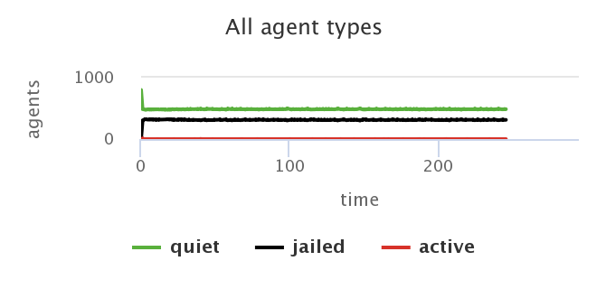
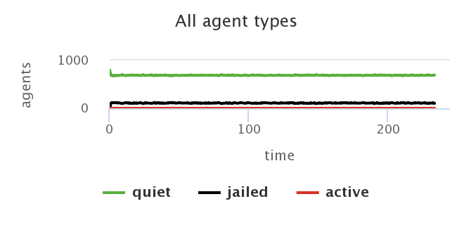
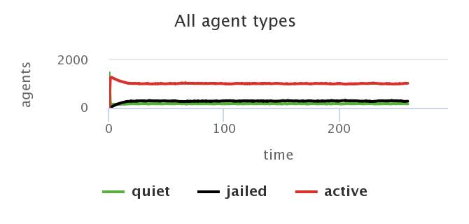

## Імітаційне моделювання комп'ютерних систем
## СПм-21-2, **Гаптельманов Артем Володимирович**
### Індивідуальне домашнє завдання. Лабораторна робота №1

 

### Обрана модель в середовищі NetLogo:
[Rebellion](http://www.netlogoweb.org/launch#http://www.netlogoweb.org/assets/modelslib/Sample%20Models/Social%20Science/Rebellion.nlogo)

 

### Вербальний опис моделі:
Моделювання повстання підкореного населення проти центральної влади. Це адаптація моделі громадянського насильства Джошуа Епштейна (2002).
Населення безладно блукає. Якщо рівень їхніх нарікань на центральну владу досить високий, а сприйняття пов’язаних з цим ризиків досить низьке, вони відкрито бунтують. Окрема група поліцейських ("копів"), що діє від імені центральної влади, прагне придушити повстання. Поліцейські безладно блукають і затримують людей, які активно бунтують.

### Керуючі параметри:
- **initial-cop-denstiy** густота поліцейських.
- **initial-agent-denstiy** густота агентів.
- **goverment-legitimacy** лояльність влади.
- **max-jail-term** максимальна кількість тактів ув'язнення.
- **vision** переміщення агента або поліцейського на ділянкуу.
- **movement** рухливість агентів.

### Внутрішні параметри:
- **# of agents** - кількість агентів.
- **# of cops** - кільість поліцейських.
- **quiet** - кількість не протестуючих.
- **jailed** - кількість ув'язнених.
- **active** - кількість протестуючих. 

### Критерії ефективності системи:
- кількість не протестуючих.
- кількість протестуючих.
- кількість ув'язнених.

### Примітки:
- При створювані поцілейського, випадково встановлюється значення ESTIMATED-ARREST-PROBABILITY (ймовірність аресту). 
- Кожен «агент» або член загального населення має індивідуальний рівень образи на центральну владу. GRIEVANCE (скарга) ґрунтується на PERCEIVED-HARDSHIP агента, яке призначається випадковим чином під час запуску, і на GOVERNMENT-LEGITIMACY.

### Недоліки моделі:
- При створювані поцілейського, випадково встановлюється значення ESTIMATED-ARREST-PROBABILITY, більш логічніше якщо, ймовірність аресту скаладалась з урахування часу протетсу, та розраховувалась від дій, які протестуючі виконують.
- Якщо в районі більше повстанців, ніж поліцейських, ймовірність арешту дорівнює нулю. Не зовсім логічно, тобто 1 поліцейский не може заарестувати 2х протестуючих.

 

## Обчислювальні експерименти

### 1. Залежність ув'язнень від легітимності влади.
Досліджуємо залежність ув'язнень від легітимності влади.
Параметри системи, при яких здійснювалась симуляція:
- **initial-cop-denstiy** 49,9%.
- **initial-agent-denstiy** 50%.
- **goverment-legitimacy** 0.
- **max-jail-term** 50.
- **vision** 10.
- **movement** True.

<table>
<thead>
<tr><th>Кількість ув'язнених</th><th>Кількість активістів</th><th>Кількість не протестуючих</th><th>Такт</th></tr>
</thead>
<tbody>
<tr><td>0</td><td>300</td><td>500</td><td>0</td></tr>
<tr><td>300</td><td>0</td><td>500</td><td>100</td></tr>
<tr><td>250</td><td>2</td><td>550</td><td>150</td></tr>
<tr><td>300</td><td>1</td><td>500</td><td>200</td></tr>
<tr><td>250</td><td>2</td><td>550</td><td>225</td></tr>
</tbody>
</table>

Залежність ув'язнень від легітимності влади.

Графік наочно показує, що лояльність влади дуже сильно впливає на протести, в результаті чого з'являються арешти.

### 2. Залежність ув'язнених від легітимності влади та строку арешту.
Залежність ув'язнених від легітимності влади та строку арешту.
Параметри системи, при яких здійснювалась симуляція:
- **initial-cop-denstiy** 49,9%.
- **initial-agent-denstiy** 50%.
- **goverment-legitimacy** 0.5.
- **max-jail-term** 10.
- **vision** 10.
- **movement** True.

<table>
<thead>
<tr><th>Кількість ув'язнених</th><th>Кількість активістів</th><th>Кількість не протестуючих</th><th>Такт</th></tr>
</thead>
<tbody>
<tr><td>0</td><td>100</td><td>700</td><td>0</td></tr>
<tr><td>100</td><td>0</td><td>700</td><td>100</td></tr>
<tr><td>100</td><td>1</td><td>669</td><td>150</td></tr>
<tr><td>101</td><td>1</td><td>669</td><td>200</td></tr>
<tr><td>90</td><td>1</td><td>709</td><td>225</td></tr>
</tbody>
</table>

Залежність ув'язнених від легітимності влади та строку арешту

Графіки наочно показують, що чим строк ув'язнення тим меньше активістів, та тим менша кількість увя'знених.

### 3. Залежність ув'язнених та активістів від кількості поцілейских.
Досліджуємо залежність ув'язнених та активістів від кількості поцілейских.

Початкові параметри системи:
- **initial-cop-denstiy** 1,9%.
- **initial-agent-denstiy** 92%.
- **goverment-legitimacy** 0.
- **max-jail-term** 25.
- **vision** 10.
- **movement** True.

<table>
<thead>
<tr><th>Кількість ув'язнених</th><th>Кількість активістів</th><th>Кількість не протестуючих</th><th>Такт</th></tr>
</thead>
<tbody>
<tr><td>22</td><td>1225</td><td>195</td><td>0</td></tr>
<tr><td>296</td><td>1021</td><td>167</td><td>100</td></tr>
<tr><td>300</td><td>1018</td><td>160</td><td>200</td></tr>
<tr><td>277</td><td>1035</td><td>165</td><td>225</td></tr>
</tbody>
</table>

 залежність ув'язнених та активістів від кількості поцілейских.

 
Графік наочно показує, що при маленькій кількості поліцейских, ефективність їх роботи досить мала, причиною цього є логіка роботи моделі.
