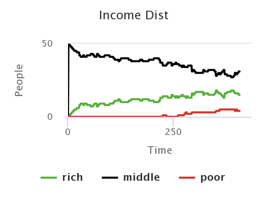

## Імітаційне моделювання комп'ютерних систем
## СПм-21-2, **Гаптельманов Артем Володимирович**
### Лабораторна робота №**1**. Опис імітаційних моделей

 

### Обрана модель в середовищі NetLogo:
[Bank Reserves](http://www.netlogoweb.org/launch#http://www.netlogoweb.org/assets/modelslib/Sample%20Models/Social%20Science/Economics/Unverified/Bank%20Reserves.nlogo)

 

### Вербальний опис моделі:
Симуляція створення грошей в економіці через приватну банківську систему. Оскільки більша частина грошей в економіці зберігається в банках, але лише незначна їх частина потребує використання (тобто у готівковій формі) у будь-який момент часу, банкам потрібно зберігати лише невелику частину своїх заощаджень для цих операцій. Ця частина загальних заощаджень відома як банківські резерви.

### Керуючі параметри:
- **reserves** коефіцієнт банківського резерву (відсоток грошей, який банк повинен зберігати в резерві в певний момент часу).
- **people** кількість людей.

### Внутрішні параметри:
- **savings** - заощадження.
- **loans** - позики.
- **wallet** - гаманець.
- **temp-loan** - тимчасовий кредит.
- **wealth** - багатство. 
- **customer** - клієнт.

### Критерії ефективності системи:
- загальну суму грошей, яка зараз зберігається в заощадженнях.
- сума, яку банк надав у позику.
- сума, яку банк має для позики.
- резерви банку.

### Примітки:
Загальна сума грошей, яку можна створити, буде такою:
(початкові гроші в системі) * (1 / РЕЗЕРВИ).

### Недоліки моделі:
- Один «супербанк» використовується в цій моделі для представлення всіх банків в економіці.
- Кошти доступні для позики > 0. Насправді було б логічніше, якщо допустима позика вираховувалась за іторією позик.
- Людина може отримати лише 5 або 2 долари, вважаю, що булоб логічніше розраховувати ці данні в залежності від кількості грошей в системи. Тому що, коли в резервах будуть 10ки тисяч, то 2 або 5 долари будуть непомітними.

 

## Обчислювальні експерименти

### 2. Вплив резерву банку на загальну кількість грошей4.
Досліджуємо залежність загальної кількості грошей банку на від відсотка резерву.
Параметри системи, при яких здійснювалась симуляція:
- **reserves**: 0
- **people**: 50

<table>
<thead>
<tr><th>Загальна кількість грошей</th><th>Відсоток резерву</th><th>Такт</th></tr>
</thead>
<tbody>
<tr><td>264</td><td>100</td><td>0</td></tr>
<tr><td>264</td><td>100</td><td>100</td></tr>
<tr><td>264</td><td>100</td><td>200</td></tr>
<tr><td>396</td><td>0</td><td>300</td></tr>
<tr><td>441</td><td>0</td><td>400</td></tr>
<tr><td>466</td><td>0</td><td>500</td></tr>
</tbody>
</table>

Залежність загальної кількості грошей від резерву.

Графік наочно показує, що зростання грошей відбувається в залежності від резерву.

### 2. Залежність гаманця людини від резервів банку.
Досліджуємо залежність гаманця людини від резерву банку.
Параметри системи, при яких здійснювалась симуляція:
- **reserves**: 100
- **people**: 50

<table>
<thead>
<tr><th>Гаманець</th><th>Резерв</th><th>Такт</th></tr>
</thead>
<tbody>
<tr><td>-2</td><td>100</td><td>2</td></tr>
<tr><td>-22</td><td>100</td><td>100</td></tr>
<tr><td>0</td><td>50</td><td>200</td></tr>
<tr><td>0</td><td>0</td><td>300</td></tr>
<tr><td>0</td><td>0</td><td>400</td></tr>
</tbody>
</table>

Залежність гаманця людини від резервів банку

Графіки наочно показують, що чим більше резерв банку тим менше вірогідність видання заощадженнь, отже люди мають на балансі відємне значення. А коли резерви малі або ж взагалі відсутні банк має змогу виділити свої грощі на позики.

### 3. Залежність статусу людини від резервів банку.
Досліджуємо статуси людей від кількості резервів банку.

Початкові параметри системи:
- **reserves**: 100
- **people**: 50

<table>
<thead>
<tr><th>Кількість багатих</th><th>Кількість бідних</th><th>Резерв банку</th><th>Такт</th></tr>
</thead>
<tbody>
<tr><td>3</td><td>0</td><td>100</td><td>3</td></tr>
<tr><td>9</td><td>0</td><td>100</td><td>100</td></tr>
<tr><td>10</td><td>1</td><td>50</td><td>200</td></tr>
<tr><td>16</td><td>3</td><td>0</td><td>300</td></tr>
<tr><td>15</td><td>4</td><td>0</td><td>400</td></tr>
</tbody>
</table>

Залежність статусу людини від резервів банку.

 
Графік наочно показує, що при 100% резервів банку бідних людей намає, це відбувається тому що программа вважає людину бідною коли вона має заощадженнь > 10. Коли збереження > 10 людину вважають багатою. 