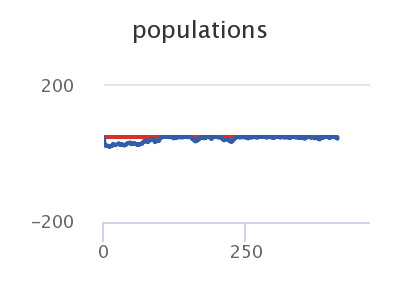
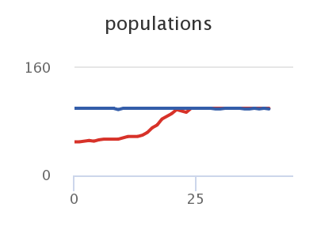
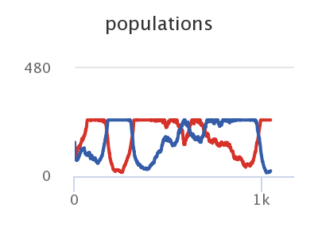

## Імітаційне моделювання комп'ютерних систем
## СПм-21-2, **Гаптельманов Артем Володимирович**
### Лабораторна робота №**2**. Опис імітаційних моделей

 

### Обрана модель в середовищі NetLogo:
[Red Queen](http://www.netlogoweb.org/launch#http://www.netlogoweb.org/assets/modelslib/Curricular%20Models/BEAGLE%20Evolution/Red%20Queen.nlogo)

 

### Вербальний опис моделі:
Ця модель демонструє ідеї конкурентної коеволюції. У моделі два види: жаби і змії. Змії є єдиними жаб, але жаби виробляють швидкодіючу отруту, яка вбиває змій, перш ніж їх можна буде з’їсти. Однак змії розробили протиотруту, щоб протистояти отруті жаби. У цій моделі ми припускаємо, що немає інших хижаків жаб або здобичі, яку поїдають змії. Таким чином, два види вступають у гонку біологічних озброєнь, щоб не відставати один від одного.

### Керуючі параметри:
- **initial-number-frogs** початкова кількість жаб.
- **initial-number-snakes** початкова кількість змій.
- **initial-poins-means** початкове значення отрути.
- **initial-resistance-means** початкове значення протиотруті.
- **max-population** максимальна кількість змій та жаб.

### Внутрішні параметри:
- **frogs** - кількість жаб.
- **snakes** - кількість змій.
- **average poison** - середнє значення отрути.
- **average resistance** - середнє значення протиотрути.

### Критерії ефективності системи:
- Популяція.
- Значення яду та протиотрути.

### Недоліки моделі:
- Змії та жаби розмножуються безстатевим шляхом.
- Змії та жаби бувають різних видів, насправді, було б логічніше використовувати різні види, тому що, кожний вид має різні властивості.

 

## Обчислювальні експерименти

### 1. Вплив резерву банку на загальну кількість грошей.
Досліджуємо вплив початкового значення протиотрути.
Параметри системи, при яких здійснювалась симуляція:
 **initial-number-frogs**: 50
- **initial-number-snakes**: 50
- **initial-poins-means**: 50
- **initial-resistance-means**: 0
- **max-population**: 100

<table>
<thead>
<tr><th>Кількість жаб</th><th>Кількість змій</th><th>Значення отрути</th><th>Значення протиотрути</th><th>Такт</th></tr>
</thead>
<tbody>
<tr><td>50</td><td>49</td><td>50,042</td><td>2.123</td><td>100</td></tr>
<tr><td>50</td><td>48</td><td>50,042</td><td>3.22</td><td>200</td></tr>
<tr><td>50</td><td>50</td><td>50,042</td><td>4.043</td><td>300</td></tr>
<tr><td>50</td><td>45</td><td>50,042</td><td>3.788</td><td>400</td></tr>
</tbody>
</table>

Залежність загальної кількості грошей від резерву.

Графік наочно показує, що популяція змій, може розмножуватись та функціонувати, навіть якщо має в 10ки разів менше значення протиотрути.

### 2. Залежність кількості жаб від змій.
Досліджуємо популяцию для ситуації коли кількість жаб менша ніж змій, при цьому маючи одинакові показники отрути та протиотрути.
Параметри системи, при яких здійснювалась симуляція:
 **initial-number-frogs**: 50
- **initial-number-snakes**: 100
- **initial-poins-means**: 25
- **initial-resistance-means**: 25
- **max-population**: 100

<table>
<thead>
<tr><th>Кількість жаб</th><th>Кількість змій</th><th>Значення отрути</th><th>Значення протиотрути</th><th>Такт</th></tr>
</thead>
<tbody>
<tr><td>58</td><td>100</td><td>25.657</td><td>25.269</td><td>10</td></tr>
<tr><td>92</td><td>100</td><td>25.739</td><td>25.41</td><td>20</td></tr>
<tr><td>100</td><td>98</td><td>26.1</td><td>25.393</td><td>30</td></tr>
<tr><td>100</td><td>99</td><td>26.44</td><td>25.619</td><td>40</td></tr>
</tbody>
</table>

Залежність гаманця людини від резервів банку.

Графік наочно показує, що популяція вирівнюється якщо показники отрути та протиотрути однакові.

### 3. Популяція змій та жаб, при початковій відсутності даних модифікацій.
Досліджуємо розвиток отрути та протиотрути при початковій відсутності цих здібностей, та вплив на популяцію жаб та змій.
Параметри системи, при яких здійснювалась симуляція:
 **initial-number-frogs**: 150
- **initial-number-snakes**: 150
- **initial-poins-means**: 0
- **initial-resistance-means**: 0
- **max-population**: 500

<table>
<thead>
<tr><th>Кількість жаб</th><th>Кількість змій</th><th>Значення отрути</th><th>Значення протиотрути</th><th>Такт</th></tr>
</thead>
<tbody>
<tr><td>250</td><td>82</td><td>4.01</td><td>5,3</td><td>100</td></tr>
<tr><td>30</td><td>255</td><td>10.24</td><td>10.24</td><td>250</td></tr>
<tr><td>250</td><td>107</td><td>17,2</td><td>19,5</td><td>450</td></tr>
<tr><td>45</td><td>250</td><td>45,9</td><td>45,27</td><td>900</td></tr>
</tbody>
</table>

Популяція жаб та змій.

Графік наочно показує, с періодом часу, одна популяція перевершує іншу, та навпаки.