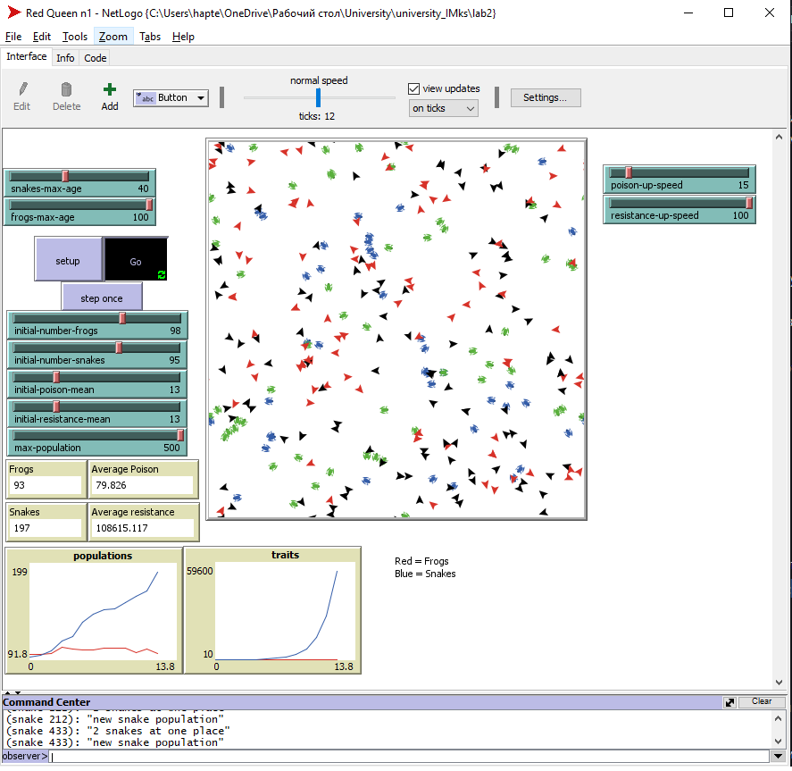

## Імітаційне моделювання комп'ютерних систем
## СПм-21-2, **Гаптельманов Артем Володимирович**
### Лабораторная работа №**2**. Редактирование имитационных моделей в среде NetLogo

 

### Выбранная модель в среде NetLogo:
[Red Queen](http://www.netlogoweb.org/launch#http://www.netlogoweb.org/assets/modelslib/Curricular%20Models/BEAGLE%20Evolution/Red%20Queen.nlogo)

 

### Вербальное описание модели:
[Red Queen](lab2.md).

### Внесённые изменения в исходную логику модели:

**Ввести понятие "возраста" лягушек и змей. При инициализации использовать случайное значение. Максимальный возраст указывается пользователем, по достижению максимального возраста, особь погибает.**
Добавлены свойства возраста для жаб и змей.
<pre>
frogs-own [struggle? poison age gender] ;; gender 1 = male, 2 = female
snakes-own [resistance age gender]
</pre>
в процедуре setup возраст жаб и змей вычисляется таким образом: 
<pre>
set age random frogs-max-age + 1
set age random snakes-max-age + 1
</pre>
В каждой итерации увеличивается и проверяется текущий возраст жаб/змей.
<pre>
if age > frogs-max-age [die]
...
set age age + 1
</pre>
<pre>
if age > snakes-max-age [die]
   ...
set age age + 1
</pre>

**Увеличивать количество яда лягушек по мере их "взросления". Скорость роста количества яда задаётся пользователем. Увеличивать сопротивляемость змей к яду по мере её "взросления". Скорость роста сопротивляемости задаётся пользователем.**
При каждой итерации увеличивается возраст соответственно и яд для жаб
<pre>
    set poison (poison + (poison * (poison-up-speed / 100)))
</pre>

При каждой итерации увеличивается возраст соответственно и резист для змей
<pre>
    set resistance (resistance + (resistance * (resistance-up-speed / 100)))
</pre>.

**Разделить особей на самцов и самок. Для размножения необходимо находится на одном участке с другим представителем своего вида другого пола. Сопротивляемость и ядовитость наследуется от родителей наибольшая**
Вычисляется находится ли жаба/змея на 1 участе с своим сородичем другого пола
Если да то выполняется функция размножения
<pre>
  if count frogs-here = 2
    [
      show "2 frogs at one place"
      if not all? frogs-here [gender = 1] and not all? frogs-here [gender = 2]
      [
        show "new frog population"
        let newpoison [poison] of max-one-of frogs-here [poison]

        hatch 1
        [
          set age 1
          set poison newpoison
          setxy random-xcor random-ycor
        ]
      ]
    ]
</pre>
Для жаб и змей установлены поля Age, они указываются с помощью рандома.
<pre>
    set gender random 2 + 1
</pre>

Скриншот модели в процессе симуляции

Итоговый код модели и её интерфейс доступны по [ссылке](lab2.nlogo).