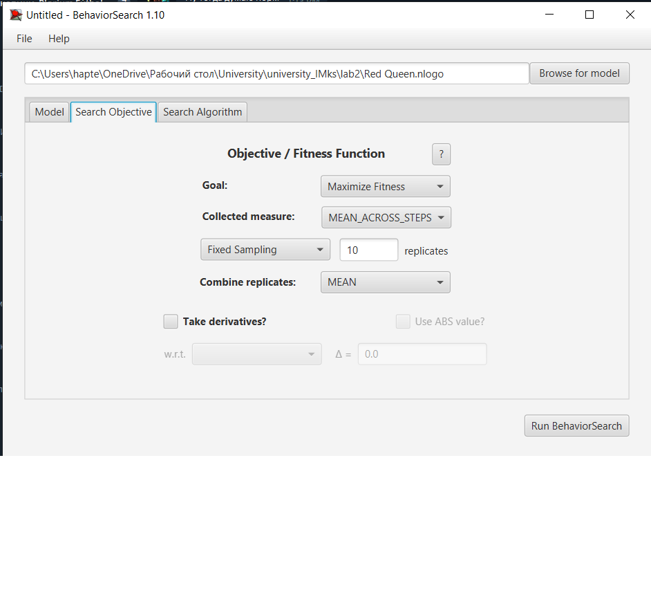

## Імітаційне моделювання комп'ютерних систем
## СПм-21-2, **Гаптельманов Артем Володимирович**
### Лабораторна робота №**3**. Використання засобів обчислювального інтелекту для оптимізації імітаційних моделей

 

### Обрана модель в середовищі NetLogo:
[Red Queen](http://www.netlogoweb.org/launch#http://www.netlogoweb.org/assets/modelslib/Curricular%20Models/BEAGLE%20Evolution/Red%20Queen.nlogo)

 

### Вербальний опис моделі:
Доступно у файлі з другої лабораторної роботи [Red Queen](https://github.com/HaptelmanovArtem/university_IMks/blob/master/lab2/lab2.md).

### Налаштування середовища BehaviorSearch:

**Обрана модель**:
<pre>
../Red Queen.nlogo
</pre>
**Параметри моделі**:  
<pre>
["initial-number-frogs" [1 1 150]]
["initial-number-snakes" [1 1 150]]
["initial-poison-mean" [0 1 50]]
["initial-resistance-mean" [0 1 50]]
["max-population" [0 1 500]]

</pre>
Параметри та їхні передбачувані діапазони були автоматично вилучені середовищем BehaviorSearch з обраної імітаційної моделі.
Для параметрів max-population, було підвищене мінімальне значення діапазону з метою унеможливлення створення симуляції в якій максимальна популяція = 1.

Використовувана **міра**:

Для фітнес-функції - було обрано загальне значення популяції жаб, вираз для її розрахунку взято з налаштувань графіка аналізованої імітаційної моделі в середовищі NetLogo.

  
та вказано в параметрі "**Measure**":
<pre>
count frogs
</pre>
Параметри "**Setup**" та "**Step**" залишаються із значеннями за замовчуванням, тобто "**Setup**" и "**Go**" відповідно.  
Параметр зупинки за умовою ("**Stop if**") в даному випадку не використовувся.

Загальний вигляд вкладки налаштувань параметрів:

**Налаштування цільової функції** (Search Objective):

Метою підбору параметрів імітаційної моделі є **максимізація** значення популяції жаб - це вказано через параметр "**Goal**" із значенням **Maximize Fitness**. Тобто потрібно знайти такі параметри налаштувань моделі, при яких кількість жаб буде найбільшою. При цьому цікавить не просто кількість в якийсь окремий момент симуляції, а її середнє значення. Для цього в параметрі "**Collected measure**", що визначає облік значень обраного показника, вказано **MEAN_ACROSS_STEPS**. Щоб уникнути спотворення результатів через випадкові значення, що використовуються в логіці самої імітаційної моделі, **кожна симуляція повторюється по 10 разів**, результуюче значення розраховується як **середнє арифметичне**.

Загальний вигляд вкладки налаштувань цільової функції:  

**Налаштування алгоритму пошуку** (Search Algorithm):

В ході дослідження на лабораторній роботі використовуються два алгоритма: Випадковий пошук (**RandomSearch**) та Простий генетичний алгоритм (**StandardGA**).
Генетичний алгоритм має такі параметри:
<pre>
mutation-rate : 0.01
population-size : 50
tournament-size : 3
population-model : generational
crossover-rate : 0.7
</pre>
Параметр "**Use fitness caching**" має значення true.
Параметр "**Evaluation limit**" має значення 3000.
Параметр "**Search Space Encoding Representation**" має значення **StandardBinaryChromosome**.

Загальний вигляд вкладки налаштувань алгоритму пошуку:  

 

### Результати використання BehaviorSearch:
Діалогове вікно запуску пошуку (залишене за замовчуванням):

Результат пошуку параметрів імітаційної моделі, використовуючи **генетичний алгоритм**:

Результат пошуку параметрів імітаційної моделі, використовуючи **випадковий пошук**:
